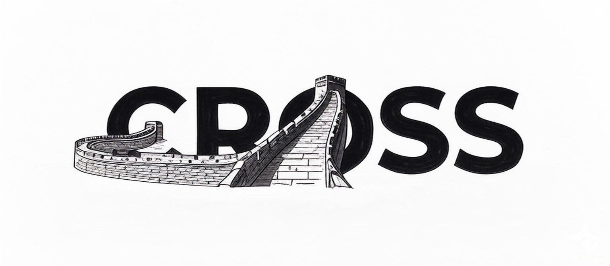

# cross

<div align="center">
  <br>
  
  <br>
  <p> <b>Across</b> the great wall, we can reach every corner in the world.</p>
</div>

[](https://www.codefactor.io/repository/github/honeok/cross)
[](https://github.com/honeok/cross)
[](https://github.com/honeok/cross)

## bench.sh

Description: A script for automated testing of I/O performance, upload & download speed, global network benchmarking, system information retrieval, and disk I/O tests.

```shell
bash <(curl -Ls https://github.com/honeok/cross/raw/master/bench.sh)
```

## nxtrace.sh

Description: The script installs NextTrace with support for stable/dev channels, custom versions, and multi-architecture compatibility.

```shell
bash <(curl -Ls https://github.com/honeok/cross/raw/master/nxtrace.sh)
```
