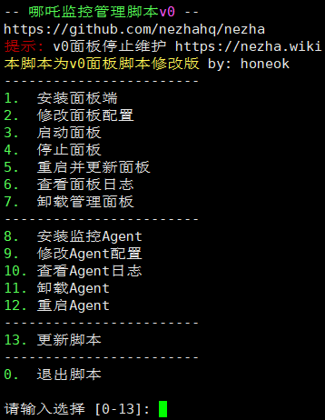

<div align="center">
  <br>
  
  <br>
  <small><i>LOGO designed by <a href="https://xio.ng" target="_blank">熊大</a> .</i></small>
  <br><br>
</div>

# 使用方法

将原有脚本替换为本脚本即可

<p align="center">
    
</p>

国外服务器：
```shell
curl -fskL raw.githubusercontent.com/honeok/cross/master/nezha/install.sh -o nezha.sh && chmod +x nezha.sh && sudo ./nezha.sh
```
国内服务器：
```shell
curl -fskL gh.611611.best/raw.githubusercontent.com/honeok/cross/master/nezha/install.sh -o nezha.sh && chmod +x nezha.sh && sudo ./nezha.sh
```

## 运行参数

编辑`/etc/systemd/system/nezha-agent.service`然后在 `ExecStart=` 这一行的末尾加上参数

参数清单：

- `--report-delay`：控制系统信息上报的间隔，默认为1秒，可以设置为3来进一步降低agent端系统资源占用（配置区间 1-4）
- `--skip-conn`：不监控连接数，推荐机场/连接密集型服务器或CPU占用较高的服务器设置
- `--skip-procs`：不监控进程数，也可以降低Agent占用
- `--disable-auto-update`：禁止自动更新Agent（安全特性）
- `--disable-force-update`：禁止强制更新Agent（安全特性）
- `--disable-command-execute`：禁止在Agent上执行定时任务、打开在线终端（安全特性）
- `--tls`：启用SSL/TLS加密（使用nginx反向代理Agent的grpc连接，并且nginx开启SSL/TLS时，需要启用该项配置）
- `--temperature`：启用GPU监控（如果支持）

**重启服务：**

```shell
# 手动编辑
sudo vim /etc/systemd/system/nezha-agent.service
sudo systemctl daemon-reload
sudo systemctl restart nezha-agent
sudo systemctl status nezha-agent

# 直接修改 禁用Agent自动更新命令
sed -i '/^ExecStart=/ {/"--disable-auto-update"/! s/$/ "--disable-auto-update"/}' /etc/systemd/system/nezha-agent.service && systemctl daemon-reload
```

## Agent版本回退

以`v0.20.5`为例，替换以下agent版本执行即可

```shell
wget -q https://github.com/nezhahq/agent/releases/download/v0.20.5/nezha-agent_linux_amd64.zip && unzip -o nezha-agent_linux_amd64.zip -d /opt/nezha/agent && rm -f nezha-agent_linux_amd64.zip && systemctl daemon-reload && systemctl restart nezha-agent
```
