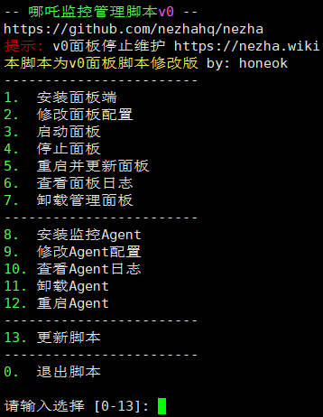

# 使用方法

将原有脚本替换为本脚本即可



国外服务器：

```shell
curl -fskL raw.githubusercontent.com/honeok/cross/master/nezha/install.sh -o nezha.sh && chmod +x nezha.sh && sudo ./nezha.sh
```
国内服务器：
```shell
curl -fskL gh.611611.best/raw.githubusercontent.com/honeok/cross/master/nezha/install.sh -o nezha.sh && chmod +x nezha.sh && sudo ./nezha.sh
```

# Agent版本回退

以v.19.5为例，替换以下agent版本执行即可

```shell
wget -q https://github.com/nezhahq/agent/releases/download/v0.19.5/nezha-agent_linux_amd64.zip && unzip -o nezha-agent_linux_amd64.zip -d /opt/nezha/agent && rm nezha-agent_linux_amd64.zip && systemctl daemon-reload && systemctl restart nezha-agent
```